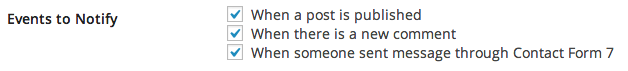
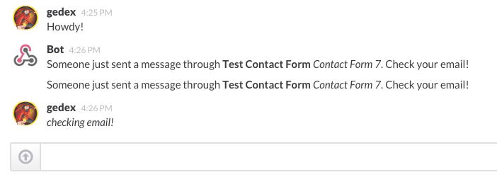

<!-- DO NOT EDIT THIS FILE; it is auto-generated from readme.txt -->
# Slack Contact Form 7

Send notifications to Slack channels whenever someone sent message through Contact Form 7.

**Contributors:** [akeda](https://profiles.wordpress.org/akeda) 
**Tags:** [slack](https://wordpress.org/plugins/tags/slack), [api](https://wordpress.org/plugins/tags/api), [chat](https://wordpress.org/plugins/tags/chat), [notification](https://wordpress.org/plugins/tags/notification), [contact](https://wordpress.org/plugins/tags/contact), [form](https://wordpress.org/plugins/tags/form), [cf7](https://wordpress.org/plugins/tags/cf7), [contact-form-7](https://wordpress.org/plugins/tags/contact-form-7) 
**Requires at least:** 4.4 
**Tested up to:** 4.7 
**Stable tag:** 0.2.0 
**License:** [GPLv2 or later](http://www.gnu.org/licenses/gpl-2.0.html) 
**Donate link:** http://goo.gl/DELyuR 

## Description ##

This plugin is an extension to [Slack plugin](http://wordpress.org/plugins/slack) that allows you to send notifications to Slack channels whenever someone sent message through Contact Form 7.

The new event will be shown on integration setting with text **When someone sent message through Contact Form 7**. If checked then notification will be delivered after Contact Form 7 sent the message through email.

You can alter the message with `slack_wpcf7_submit_message` filter. The filter receives following parameters (ordered by position):

* `$message` &mdash; Default message to send to Slack
* `$form` &mdash; Form object
* `$result` &mdash; Array of result

**Development of this plugin is done on [GitHub](https://github.com/gedex/wp-slack-contact-form-7). Pull requests are always welcome**.

## Installation ##

1. You need to install and activate both Contact Form 7 and [Slack](http://wordpress.org/plugins/slack) plugins first.
1. Then upload **Slack Contact Form 7** plugin to your blog's `wp-content/plugins/` directory and activate.
1. You will see new event type with text **When someone sent message through Contact Form 7** in integration setting. If checked then notification will be delivered after Contact Form 7 sent the message through email.

## Screenshots ##

### Event option in integration setting

### Your channel get notified when someone sent message through your Contact Form 7

## Changelog ##

### 0.2.0 ###
* Fix message is not being sent to Slack caused by changes in wpcf7_submit result arg.

### 0.1.0 ###
* Initial release

